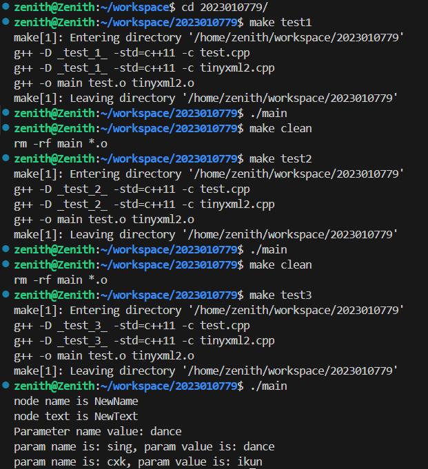

# 运行方法

在Linux环境下打开此文件夹，执行命令

```bash
make test1
./main
```

编译运行create()函数，可得到example.xml。

接着执行命令

```bash
make clean
make test2
./main
```

编译运行modify()函数，可得到example_modified.xml。

接着执行命令

```bash
make clean
make test3
./main
```

编译运行read()函数，在命令行得到运行结果。

